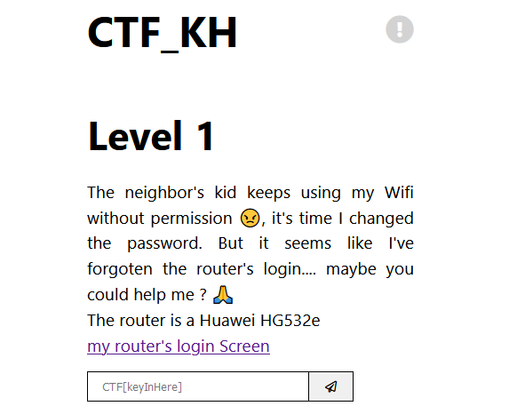

# CTF-Basic

A simple capture the flag game.
Please note that this CTF, unlike others, does not require any skills.

## Preview

Deployed on Heroku 👉 <https://ctfkh.herokuapp.com/>

## Getting Started 🛠

These instructions will get a copy of the project up and running on your machine for development and testing purposes.

### Prerequisites

To run this project locally, the following tools need to be installed:

1. Node.js
2. VSCode / any editor of your choice

### Development

1. Clone the project
2. Use `npm install` to install all dependencies within [package.json](package.json)
3. To start the application run `npm start`
4. Visit <http://localhost:5000/>

## Contributing 🙏

When contributing to this repository, please first discuss the change you wish to make via issue, email, or any other method with the owners of this repository before making a change.
Make sure to check the [CONTRIBUTION GUIDE](CONTRIBUTION.md)

- **[MIT license](LICENSE)**
Copyright 2020 © JesAym.
